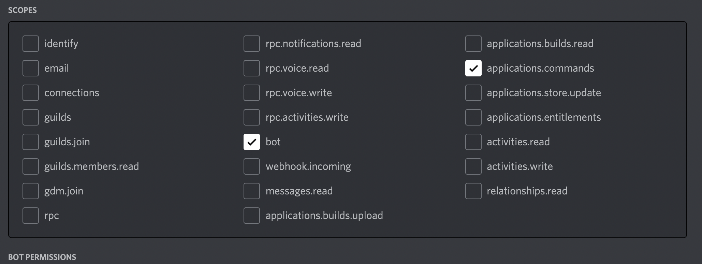
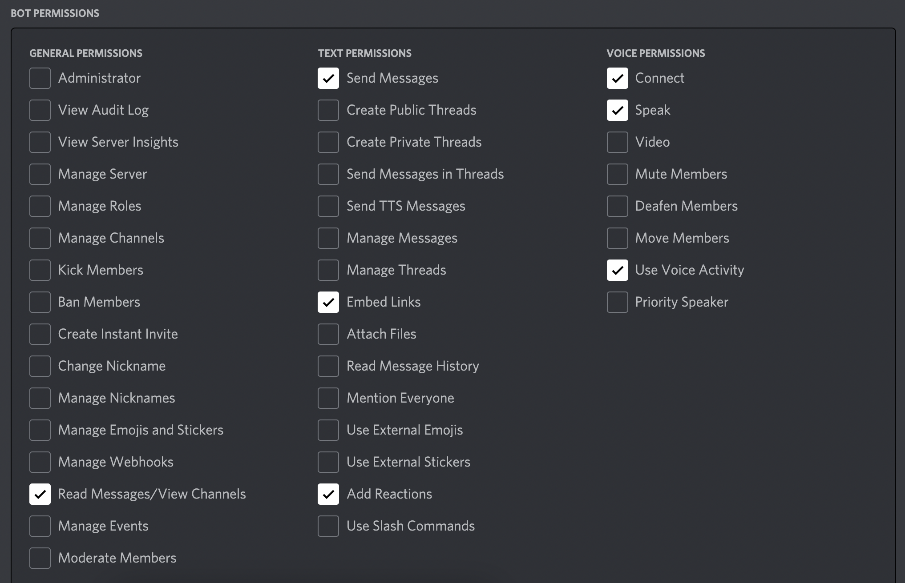

# music-discord-bot

Discord music bot backend to play music from youtube and spotify with audio modulation features such as bass and treble

# Support

Join my discord [server](https://discord.gg/Uwfq9fJzmA) for queries, suggestions and support.

# Bot commands

-   /help
-   /play url or name or index
-   /add url or name
-   /next
-   /pause
-   /resume
-   /leave
-   /clear clears the song queue
-   /bass values from 1 to 50
-   /treble values from 1 to 50
-   /partytogether \<select the options displayed\>
-   link to [instructions](./instrcutions.txt)

# Requirements

-   Node >= v16
-   Can be downloaded from official node [webpage](https://nodejs.org/en/)

# Setup

-   Login to discord developer portal and create a new application.
-   Once the application is created open the application to get its application_id.
-   To get client_token open the bot tab and enable the bot. 
-   Invite the bot to your server with minimum server permissions as shown below and the invite-url can be generated in URL-generator tab of your application.

### Minimum bot Permissons




-   As this backend uses play-dl, read these [instructions](https://github.com/play-dl/play-dl/blob/main/instructions/README.md) on how to authorise your bot to play music from spotify or to add youtube cookies.
-   Once all the keys are obtained create a .env file in root directory.

### Example .env file

-   In .env file, except client_token and application_id all others are spotify keys which are obtained from the instrcutions mentioned above

```
CLIENT_TOKEN=xxxx
APPLICATION_ID=xxxx
CLIENT_ID=xxx
CLIENT_SECRET=xxx
REFRESH_TOKEN=xxx
```

# Running

Run these commands in root directory

-   Install dependencies:

```
npm install
```

-   After installing the dependencies and before inviting the bot to your servers run this command:

```
node register-commands.js
```

-   Now launch this bot backend using npm start and invite the bot to your servers.

```
npm start
```

# Contributing guidelines

-   Please raise pull requests to dev branch
-   Helpful git commands can be found in this [website](https://shobhi1310.github.io/contributions/CONTRIBUTING.html)
-   If pull requests are raised into main branch they will be rejected
-   Please feel free to raise [issues](https://github.com/darahask/music-discord-bot/issues) if you want to improve anything in particular

# Contributors

#### [Darahas Kopparapu](https://github.com/darahask)
